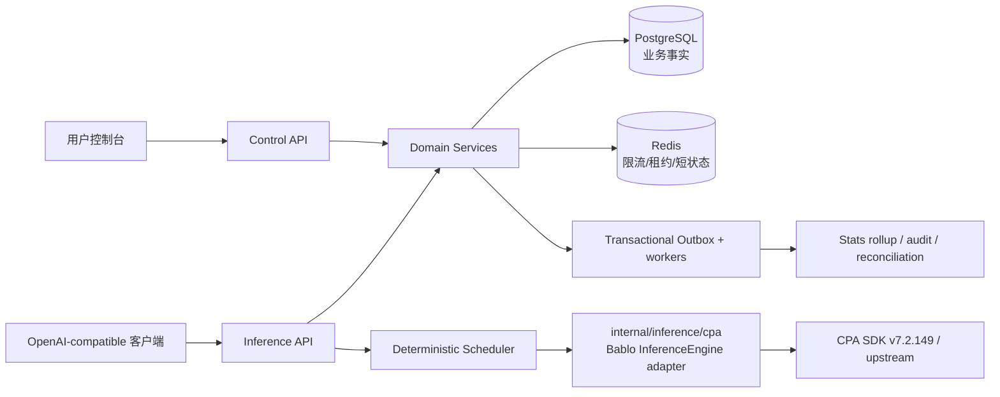

# Bablo 总体架构

> 版本：架构规划基线
> 日期：2026-09-04
> 相关 ADR：`docs/adr/0001-cpa-sdk-boundary.md`、`docs/adr/0002-postgres-source-of-truth.md`、`docs/adr/0003-usage-ledger-billing.md`、`docs/adr/0004-model-routing-and-scheduler.md`、`docs/adr/0005-web-session-authentication.md`

## 1. 架构结论

第一阶段采用**模块化 Go 单体**：同一 `bablo` 进程同时承载管理面、推理面和后台 worker；PostgreSQL 保存所有业务事实，Redis 保存可重建运行时状态，CPA 只在 `internal/inference/cpa` 适配器中出现。这样先降低部署和事务复杂度，同时让模块接口、幂等键和 Redis 协调契约可在未来拆分/扩展到 HA。



## 2. 进程与部署拓扑

### P0 单实例

- `bablo`：HTTP server、CPA service、scheduler、usage settlement、wallet reservation/settlement、payment operation/reconciliation、outbox/quota worker；
- PostgreSQL：唯一业务数据库；只允许私网/容器网络访问；
- Redis：生产必需的登录/MFA 双维 fixed-window、API Key RPM/TPM、credential concurrency lease、短 TTL affinity/cursor；全部状态可重建，错误 fail closed。非生产无 Redis 时才允许有界进程内 fallback；daily/monthly budget、身份权限和钱包余额只由 PostgreSQL 事实判定；
- 反向代理/TLS：部署环境提供，域名不写死；只有直连 peer 命中显式 trusted CIDR 时，Web 登录/MFA 才接受其 `X-Forwarded-For` 链；
- CPA management endpoint：不暴露公网，优先不启用远程管理。

### HA 演进

多个 `bablo` 实例共享 PostgreSQL/Redis。所有跨实例状态必须有 TTL、租约所有者和恢复策略：

- Redis lease 用 token 校验释放，过期后自动回收；
- DB transaction 保证 ledger/usage/payment 幂等；
- outbox worker 用 claim/lease 避免重复副作用；
- CPA adapter 每实例拥有本地 engine，但控制面配置由 PostgreSQL 生成并可重放；
- 不把 CPA config/auth 文件、Redis 或进程内 map 当主数据源。

## 3. 模块边界

每个模块只能通过 service/use-case 接口调用其他模块；handler 不直接拼 SQL。下表是第一阶段必须保留的领域边界。

| 模块 | 负责 | 输入/输出 | 明确禁止 |
|---|---|---|---|
| `user` | 用户生命周期、状态、角色关系 | user ID、profile、role | 推理 Key 校验、账本 SQL |
| `auth` | `internal/auth` 已实现登录、Argon2id、Session、密码、TOTP/recovery、RBAC/CSRF；`bablo auth` 提供本地管理员维护 | session principal、authorization decision、一次性 Cookie/MFA enrollment material | 把 Web Session 当推理 API Key、在 handler 绕过 service 授权 |
| `apikey` | Key CSPRNG 生成/SHA-256 hash、一次性明文、撤销、过期、原子轮换、IP/RPM/TPM/预算阈值、policy entitlement | key principal、policy/model authorization decision | 保存明文 Key、把 Key 绑定单一 group/provider、把 Redis 当权限事实源 |
| `model` | public model、canonical alias、能力、visibility、billing class、route readiness | model capability、alias resolution | 散落模型字符串、直接覆盖人工目录 |
| `provider` | Provider 元数据、资源政策、上游模型发现/审核 | provider ID、provider model、discovery signal | 处理 OAuth secret 明文；把发现结果直接变成可路由配置 |
| `credential` | 加密 secret metadata、健康、pool membership、active runtime source | Credential ID、非敏感 metadata、transient runtime credential | 日志输出 token、让 subscription 默认商业可用 |
| `route` | public model 到版本化 target 的匹配/快照 | route snapshot、candidate targets | 未授权 fallback、请求中途变更快照 |
| `scheduler` | 硬过滤、确定性选择、租约、Decision Log | candidates、policy、quota snapshot | 隐式随机、选择 disabled/revoked credential |
| `quota` | 合法 Provider quota/health 观测、immutable snapshot、staleness、退避和 probe lease | `QuotaProbe`/`HealthProbe`/`ResponseObserver`、Scheduler quota policy | 猜测未公开 endpoint、把旧 snapshot 当新值、把 opaque signal 推导成 token 容量 |
| `usage` | request/attempt、immutable UsageEvent、reconcile/outbox | token/status/latency、settlement key | 依赖 CPA usage queue 作为最终账 |
| `pricing` | price version、resolved target 价格 | 已发布 price snapshot | 用 float、重写历史价格、让 draft 入账 |
| `wallet/billing` | exact quote、reservation、settlement、charge/release/refund/adjustment、budget | ledger entry、pending settlement、balance projection | UPDATE 历史 ledger、并发透支、只按 alias 计费 |
| `payment` | Provider-neutral order/event/refund 状态机、voucher/admin credit、webhook 验签与 Stripe adapter | safe checkout redirect、verified provider event、ledger idempotency key | 信任客户端支付成功、持久化 Provider secret、在未验签前到账/退款 |
| `stats` | 从 Usage/Ledger 的查询和 rollup | filters、aggregates | 自建另一套计费公式 |
| `audit` | 管理员/敏感动作不可变记录 | actor/action/target/result | 记录 secret、Prompt/响应正文 |
| `inference/cpa` | CPA SDK lifecycle、请求/流、错误和 capability 映射 | Bablo `InferenceEngine` 类型 | 向业务泄漏 CPA 类型或 import CPA `internal/*` |


### Auth 已实现调用边界

`internal/auth.Handler -> auth.Service -> auth.Repository -> internal/data.Store`。Handler 只负责 JSON、Cookie、Origin/CSRF 传输校验和稳定错误；密码验证、Session rotation、管理员 MFA 与角色判断在 Service；所有身份事实、Session 撤销、MFA counter/recovery code 消费和 audit 在 PostgreSQL 事务内完成。前端只消费 Bablo Session DTO，不接触 hash、MFA ciphertext 或数据库类型。

管理员目录写接口统一经 `auth.Handler.ProtectRole(..., "admin")`，再由 model/provider/pricing service 复核输入、事务和 audit；普通 Web Session 只能访问用户模型目录，不能绕过 RBAC 写资源。

登录与 MFA limiter 使用同一 `AttemptLimiter` 边界但独立 namespace：每账号与每 source address 同时计数，生产由 Redis Lua 原子执行并 fail closed；非生产单实例可使用有界内存实现。PostgreSQL 仍是用户、角色、Session 撤销、MFA 和 audit 的唯一事实源，Redis 丢失不能恢复权限或 Session。可信代理 CIDR 只决定是否接受直连代理提供的 forwarded chain，不允许客户端自报地址。

### API Key 调用边界

`internal/apikey.Handler -> apikey.Service -> apikey.Repository -> internal/data.Store`。Web Session `auth.Handler.Protect` 只为用户自助 Key API 提供 full-session、Origin 和 CSRF 边界；推理面只通过 `Authorization: Bearer` 进入 `apikey.Service.IdentityMiddleware`，上下文只携带内部 user/key ID、prefix、secret version 和限额，不携带 raw key/hash。实际推理 handler 在解析请求模型和 token 估算后必须继续调用 `Service.Authorize`，以当前 user/key/secret version 重新检查有效性，再完成 model entitlement 与 RPM/TPM 门禁，不能只依赖身份中间件。

每个用户创建的 Key 拥有 default-deny managed policy；一个 policy 可允许多个 public model，显式 deny 优先于 allow。轮换原子替换同一 Key 的 hash，旧 secret 立即失效；P0 不提供双 Key 并行窗口。PostgreSQL 保存 Key、policy、授权和撤销事实；Redis 仅保存带 TTL 的固定窗口计数，Redis 丢失不能恢复权限或撤销状态。daily/monthly budget 阈值进入 Key principal，并由 Billing 在 API-key advisory transaction lock 下与已结算 charge、active/pending reservation 一起核验。

### Route 调用边界

`route.Service` 只负责把 requested public model/alias 解析为一个固定的 `route_version` 和有序 candidate targets；它不读取 API Key secret、不解密 Credential、不选择 pool member，也不执行上游请求。P0 仅支持 exact match，Route 创建或发布新版本在同一 PostgreSQL transaction 中校验 provider-model/pool 的 Provider 归属、模型映射和商业政策，关闭旧 version 后原子切换 `model_routes.active_version_id`。

`route_versions` 与 `route_targets` 作为 immutable snapshot 保存；旧 version 只允许一次性写入 `effective_to`。管理员 preview 只返回 route candidates，不触发 scheduler 或 Credential runtime。推理流水线必须先完成 API Key entitlement，再使用 resolver 输出交给 scheduler。

### Quota 调用边界

`internal/quota.Service` 只接收 Bablo `QuotaProbe`、`HealthProbe`、`ResponseObserver` 和 `Persistence` 接口。Proxy 在真实上游响应完成后只传递已 allowlist 的安全 response headers；observer 必须是被动的，不得再发上游请求。当前 CPA v7.2.149 public signal API 仅支持 Claude/Codex，adapter 不为 Gemini、Grok 或未知 Provider 猜测 quota endpoint。

主动 worker 从 PostgreSQL 解析 Credential/Provider 身份，使用 Redis `SET NX PX` owner-token lease（无 Redis 时仅 P0 单实例使用内存 lease），在一个受租约期限约束的探测周期内执行 quota probe 和 health probe。成功的每个 window 与 probe state 在同一 PostgreSQL transaction 提交；重复 observation key 必须相同，否则返回冲突；失败只更新可重建 state 和退避，不刷新 `observed_at`。View 按 `observed_at`、`reset_at` 和配置的 max age 计算 stale。Scheduler 只有显式启用 `QuotaPolicy` 才读取快照，`RequireFresh` 对 missing/stale 保守拒绝，未知 token 数值不推导容量。

管理员通过 `GET /api/v1/admin/credentials/{id}/quota` 查询有限 snapshot/state；响应不含 secret、Prompt 或响应正文。Quota worker 错误不会改变 PostgreSQL 账务事实，也不会绕过 Credential health/cooldown。

### Billing 调用边界

`internal/proxy -> billing.Service -> billing.Repository -> internal/data.Store`。Proxy 先完成 entitlement、immutable route snapshot、Scheduler credential 选择和 resolved provider-model price snapshot，再调用 `Reserve`；非零 reservation 固定 request、wallet、route/provider/credential、price version 和预估 token。`Reserve` 先串行化 API Key budget，再锁 wallet 把 available 转入 reserved，失败时不调用 CPA。

推理完成后 `internal/usage` 先提交 immutable UsageEvent/outbox，随后 Billing 使用该 Event 幂等 `Settle`。少于预留追加 release，多于预留从 available 补扣；补扣不足保留 reservation、设置 wallet financial hold 并写 pending settlement/outbox。后续 credit 在同一 wallet 事务内按 FIFO 回收 open liability；独立 settlement recovery worker 通过 owner lease 重试 pending settlement，任一欠费未清除前 financial hold 持续阻止新消费。missing usage 按 reservation 金额标记 estimated/reconcile 后结算，不作为免费请求。ledger delta 是余额重建权威，数据库拒绝历史 UPDATE/DELETE；用户/管理员钱包查询 HTTP surface 后置到 `bablo-user` / `bablo-admin`。

### Payment 调用边界

`internal/payment.Handler -> payment.Service -> payment.Repository -> internal/data.Store`。Service 只依赖 Bablo `payment.Provider` 接口；Stripe SDK 仅存在于 `internal/payment/stripe.go`，当前精确锁定 `stripe-go/v86 v86.2.0`。创建订单先持久化 Bablo order，再用 order number 派生稳定 Provider idempotency key；Provider operation 以 payload hash、merchant/live mode、owner token 和短租约持久化单飞与崩溃恢复；Checkout response 只保存/返回允许的 redirect URL 与非敏感 Session ID。

`/webhooks/stripe` 在任何数据库写入前验证原始 body 的 `Stripe-Signature`、timestamp、API release train、Connect account/merchant 和 live mode。验签后进入订单行锁事务，要求所有本地已有的 order/trade/refund/payment-intent/charge 标识同时一致。付款成功追加 recharge ledger；Bablo 退款先 hold available，success 消费、definitive failure 释放、未知结果保持 pending；Provider 外部退款和 charge dispute 通过 wallet liability 回收余额并在不足时冻结新消费，争议胜诉追加反向 ledger。fixture 只用于显式 opt-in 的非生产测试；真实 Stripe test-mode E2E 未完成前 self-service payment 保持 NO-GO。

## 4. 稳定领域接口

以下是边界形状，不是对 CPA API 的猜测；实际 CPA 适配以 `docs/upstream-compatibility.md` 锁定 tag 源码为准：

```go
type Engine interface {
    Execute(context.Context, Request) (ExecutionResult, error)
    ExecuteStream(context.Context, Request) (Stream, error)
    Capabilities(context.Context) (Capabilities, error)
    Shutdown(context.Context) error
}

type Request struct {
    RequestID      string
    ResolvedRoute  ResolvedRoute
    SourceFormat   string
    ResponseFormat string
    Headers        map[string][]string // 由 HTTP 层过滤敏感/hop-by-hop 头
    Metadata       map[string]any      // 仅内部提示，不记录正文
    Body           []byte              // 仅适配器边界；不进入普通日志/持久化
    Stream         bool
}

type ResolvedRoute struct {
    RouteID, RouteVersionID string
    ProviderID, CredentialID string
    RequestedModel, ResolvedModel string
}

type Stream interface {
    Next(context.Context) (StreamEvent, error)
    Headers() map[string][]string
    Close() error
}
```

`ExecutionResult`、`StreamEvent`、`Capabilities`、`ResolvedRoute` 都是 Bablo 自有领域类型。CPA SDK 任何 `Auth`、`executor.Response`、`StreamResult`、config alias 都不能出现在 handler/service/repository 的签名中。

## 5. 推理请求流水线

1. 入口生成/接收稳定 `request_id`，过滤 hop-by-hop 和敏感 header；
2. 以 Bearer Key hash 查找 `api_key`，检查 active、expiry、IP、模型 entitlement 和 RPM/TPM；
3. 解析 canonical public model 和 immutable route version，得到有序 candidates；
4. scheduler 硬过滤 resource policy、enabled/revoked、协议/能力、cooldown、quota freshness 和 concurrency lease，再按确定性策略选择具体 provider model/credential；
5. 针对实际 resolved provider model 解析已发布且当前生效的 price snapshot；
6. Billing 以 API Key budget lock + wallet row lock执行 daily/monthly budget 和 available -> reserved；余额不足、预算超限或缺价时在调用 CPA 前失败；
7. 通过 CPA adapter 执行非流式/流式；Credential runtime 由 PostgreSQL service 解密后以 `runtime_only` auth 注册，CPA 不成为主数据源；
8. 流式首个 payload 发出后不得透明切换 credential；客户端取消仍须释放租约并尽力取得 usage；
9. 生成一次 immutable UsageEvent，绑定 wallet、resolved provider/model/route/credential 和 price version；缺失 usage 标为 estimated/reconcile-needed 并使用 reservation 金额；
10. Billing 以 UsageEvent 幂等 settle：消费 reserved、释放余量或补扣 available；不足写 pending/retry outbox，不静默免费；
11. 异步 worker 消费 Usage/Billing outbox，更新 stats、health、告警和 reconciliation；
12. 记录不含 secret/body 的日志、metrics 和 scheduler decision。

## 6. 事务边界与失败语义

- **鉴权/路由**：读事务或一致性快照；一个请求使用固定 route version；
- **预算预留**：API-key advisory transaction lock 计算周期 charge + active/pending reservation，再锁 wallet 行；reservation/ledger/outbox 同事务提交，拒绝时不触发上游请求；
- **Usage finalize**：immutable `usage_events` 与 Usage outbox 同事务提交；与 Billing settlement 分成可恢复的两个事务边界，崩溃窗口由 request/reservation/Usage 唯一键和 retry worker 收敛；
- **结算**：reservation、wallet projection、usage charge/release ledger、`billing_settlements` 与 Billing outbox 同事务提交；不足进入 pending，不产生负余额或静默免费；
- **支付**：Provider API 调用与数据库事务分离；stable idempotency key 和 pending 状态收敛不确定结果。验签 webhook 在一个 transaction 内锁订单并提交订单状态、immutable payment event、wallet ledger、audit/outbox；Provider event ID 唯一。退款在外部调用前以单独事务 hold 余额，只有 verified terminal event 结算或释放；
- **Scheduler lease**：Redis `SET NX PX` + owner token，finally/recovery 释放；Redis 故障时进入保守失败，而不是超卖并发；
- **CPA 失败**：首包前允许有限、可记录的 fallback；首包后只上报错误并结算已知或 reserved estimated usage；不得重复真实执行请求；
- **进程崩溃**：数据库事实可恢复；outbox/settlement worker 重新 claim；Redis 状态过期后重建。

## 7. 调度第一版

候选先按 route target priority、pool member priority 和稳定 target/member/credential ID 分组，随后执行显式策略。硬过滤覆盖 resource commercial policy、target/provider model/pool/provider/member/credential enabled 状态、revoked、协议/模型能力、429 cooldown、地区/代理、quota missing/stale/reset/exhausted 和 concurrency lease。生产默认使用无隐式随机的 round-robin；同一模块已实现显式 weighted-round-robin、fill-first、quota-aware 和有限 session affinity，且 affinity 永远不能绕过硬过滤。每次成功或无可用候选都写 candidates、排除原因、score/priority、selected target/provider/credential、fallback chain 和 strategy version。Redis 以 TTL + owner token 保存 lease/cursor/affinity；未配置 Redis 时仅允许 P0 单实例使用内存协调器。

## 8. 可观测性与隐私

结构化 JSON 日志字段至少包含 request_id、内部 user/key/route/provider/credential ID、status、error_class、latency；Prometheus labels 不使用 user_id、key_id、request_id 等高基数值。默认不记录 Prompt/响应、Authorization、Cookie、完整 Key、OAuth token、支付密钥。调试采样必须显式开启、脱敏、短 TTL、可审计。

## 9. 代码与部署落地顺序

执行顺序和验收标准以 `docs/implementation-status.md` 为唯一进度表，严格对应 `.omp/commands/bablo-next.md`：先 `bablo-bootstrap` 建立骨架，再 CPA 边界、数据层、认证/Key、目录/路由/调度、代理、Usage/账务，最后可观测性、安全、测试、压测、部署、CI、审计和 ship 门禁。
