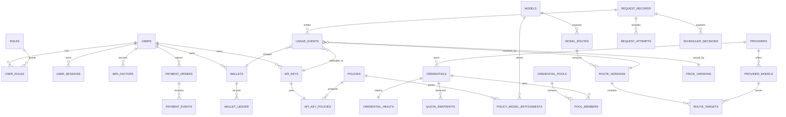

# Bablo 数据模型规划

> 已由 `migrations/000001_initial_schema.sql`、`migrations/000002_fact_table_guards.sql` 与 `migrations/000003_wallet_payment_integrity.sql` 落地；后续迁移必须新增版本文件，不得重写已应用文件。
> 日期：2026-08-29
> 事实来源：PostgreSQL；Redis 只存可重建状态

## 1. 全局规则

- 所有主键使用项目统一的 UUIDv7（若实现阶段因驱动限制采用等价有序 UUID，必须在 ADR/迁移说明）；时间统一 UTC `timestamptz`；
- 金额用 `amount_minor bigint` + `currency char(3)`，或经核准的 PostgreSQL `numeric`；禁止 float；
- Token、计数、版本号使用整数；延迟使用整数微秒/毫秒，避免隐式浮点；
- 账本、UsageEvent、PaymentEvent、AuditLog 追加式且不可破坏式删除；纠错新增 adjustment/reconciliation；
- API Key 只存不可逆 hash、短 prefix、元数据；Credential secret 只存 AEAD ciphertext、nonce、key_version；
- 所有业务外键明确租户/所有者检查，禁止仅靠前端隔离；
- route 和 price 在请求开始时形成不可变 snapshot，后续配置修改不重写历史。

## 2. 核心实体关系

## 3. 实体与关键字段

### Identity / policy

- `users`：`id`, `email_normalized`, `password_hash`, `password_params_version`, `status`, `created_at`, `updated_at`；
- `roles`、`user_roles`：至少 `admin`、`user`；角色变更写 audit；
- `user_sessions`：`id`, `user_id`, `token_hash`, `expires_at`, `revoked_at`, `last_seen_at`, device metadata；数据库不存明文 session token；
- `mfa_factors`：`user_id`, factor type, encrypted secret metadata, enabled, confirmed_at；恢复码只存 hash 和使用标志；
- `api_keys`：`id`, `user_id`, `name`, `prefix`, `secret_hash`, `status`, `expires_at`, IP policy, RPM/TPM/daily/monthly budget, `last_used_at`；没有 `group_id`/单一 `provider_id`；
- `policies`、`api_key_policies`、`policy_model_entitlements`：表达 Key -> policy -> 多模型 entitlement；deny 优先级和默认拒绝策略在 service 层固定并测试。

### Catalog / route / credential

- `models`：public model ID/alias、canonical capabilities、visibility、billing class、enabled；
- `providers`：slug、display name、`resource_type`（`official_api`/`enterprise_api`/`subscription`/`third_party`）、`commercial_allowed`、endpoint policy；
- `provider_models`：`provider_id`, upstream model ID, protocol/capabilities, enabled；一个 public model 可对应多个 provider model；
- `credentials`：provider、external stable ID、source kind、status、proxy/region metadata、pool state；
- `credential_secrets`：credential 一对一或版本化记录，`ciphertext`, `nonce`, `key_version`, secret kind；与普通 credential metadata 分离；
- `credential_pools`、`pool_members`：可供 route target 使用的资源池，成员有 priority/weight/enabled；
- `credential_health`：last success/error class、cooldown_until、observed_at；
- `model_routes`：public model、match type/value（P0 exact）、enabled、active version；
- `route_versions`：route、monotonic version、effective window、created_by、snapshot hash；
- `route_targets`：route version、provider model、credential pool、priority、weight、commercial policy、enabled；请求使用单一 version snapshot。

### Quota / pricing

- `quota_snapshots`：credential、window kind、used/remaining/limit（可空）、reset_at、observed_at、source、confidence、error、stale 计算信息；采集失败不刷新 `observed_at`；
- `price_versions`：scope、version、effective_from/to、currency、status、created_by；
- `model_prices`：price version、resolved provider model 或 billing scope、input/output/cache-read/cache-write/reasoning/per-request 单价；缺价不得静默按 0。

### Request / usage / scheduler

- `request_records`：`request_id`, user, API key, endpoint, requested model, stream flag, started/finished, terminal status；不存正文；
- `request_attempts`：request、attempt_no、route version、provider、credential、upstream status/error、latency/TTFT、started/finished；用于 fallback 与排障；
- `usage_events`：不可变结算事实，包含 request/user/key、requested/resolved model、provider/route version/credential、price version、token breakdown、status/error、latency/TTFT、estimated/provenance、settlement key；
- `usage_reconciliations`：CPA usage signal/迟到 usage/估算修正与差异，不覆盖原始 UsageEvent；
- `scheduler_decisions`：request/attempt、候选内部 ID、排除原因、score/priority、selected、fallback chain、strategy version；JSON 只含非敏感 metadata；
- `outbox_events`：与关键业务事务同库提交，worker 可重试、claim、幂等消费。

### Wallet / payment / audit

- `wallets`：user、currency、可选事务维护的 `available_balance_minor`、状态和 version；余额是 ledger 的派生缓存；
- `wallet_ledger`：wallet、entry type（reservation/usage_charge/release/recharge/refund/adjustment/grant 等）、signed amount、currency、reference、idempotency key、operator/source、created_at；追加式；
- `payment_orders`：全局 order no、user、amount/currency、provider、provider trade no、状态机 `created -> pending -> paid/failed/expired/refunded/closed`；
- `payment_events`：provider event/trade ID、原始 payload hash（非必要正文）、验签结果、received_at、处理状态；
- `audit_logs`：actor、action、target、before/after 摘要（脱敏）、request ID、result、created_at；
- `stats_rollups`：按小时/天和受控维度聚合，必须可由 Usage/Ledger 重建，不是事实源。

## 4. 唯一约束与幂等键

| 对象 | 必须唯一/幂等 |
|---|---|
| user | `lower(email_normalized)` |
| session | `token_hash`；撤销不删除历史 |
| MFA recovery | `(factor_id, recovery_code_hash)`，单次消费需行锁/条件更新 |
| API Key | `secret_hash`；prefix 仅展示索引，不代替 hash |
| entitlement | `(policy_id, model_id)` |
| provider/model | `(provider_id, upstream_model_id)` |
| credential | `(provider_id, external_stable_id)`（无稳定 ID 时用受控 fingerprint） |
| pool membership | `(pool_id, credential_id)` |
| route version | `(route_id, version_no)`；target 顺序/目标 identity 在同一 version 内唯一 |
| public model | `public_model_id` |
| price | `(price_version_id, pricing_scope, dimension)`，同一 effective 版本不能重叠 |
| request | `request_id` |
| usage settle | `settlement_key`（建议 logical request + terminal settlement version）；重复 finalize 返回已有结果 |
| wallet ledger | `(wallet_id, idempotency_key)`；充值/扣费 reference 另加唯一约束 |
| payment order | `order_no`；外部 trade no 在 provider scope 内唯一 |
| payment event | `(payment_provider, provider_event_id)`；防重放 |
| scheduler decision | `(request_id, attempt_no, decision_no)` |
| audit | `event_id` 或 `(request_id, actor, action, target, nonce)` 按实现选定 |
| outbox | `(aggregate_type, aggregate_id, event_type, idempotency_key)` |

所有幂等键必须由服务端生成或从受信任的 provider event/request identity 派生，不能接受客户端任意覆盖账务事实。

## 5. 并发与账务不变量

1. 钱包扣费/预留必须在 PostgreSQL transaction 中锁定 wallet 行或采用已证明等价的原子更新；不能先读余额再普通 UPDATE；
2. 任何 ledger entry 成功提交都必须有唯一 idempotency key；重试不新增第二笔；
3. reservation、release、usage charge 的净额与状态转换可重放；余额不得突破配置的负余额政策；
4. `usage_events`、`payment_events`、`audit_logs` 不 UPDATE 既有事实来“修正”；新增 adjustment/reconciliation；
5. price version 切换只影响新请求；历史 Usage 永远引用旧版本；
6. Redis 丢失不改变 PostgreSQL 账务；Redis lease/限流重建后不能绕过 DB 权限和预算事实。

## 6. 索引、保留与迁移

首批索引围绕真实查询：`user_id + created_at`、`api_key_id + created_at`、`public/resolved_model + created_at`、`provider_id/credential_id + created_at`、`request_id`、`order_no`、`status + created_at`、`observed_at`。高增长表按时间范围评估分区，但没有基准数据前不预先复杂分区。

Raw Usage、scheduler/audit、payment payload hash 和 rollup 的 retention 必须配置化并区分合规需要；账本与财务证据不得因 dashboard retention 被删除。所有结构变更走 SQL-first migration，要求空库 up、连续升级、重复启动安全和约束测试。当前首批 schema 已落地，高增长表仍保持未分区，待真实基准数据证明需要后再迁移。

## 7. 当前实现映射

- `migrations/000001_initial_schema.sql` 创建本规划列出的身份、授权、模型、Provider、Credential、Route、Quota、Price、Request、Usage、Wallet、Payment、Audit、Outbox 和 Stats 核心表。
- `migrations/000002_fact_table_guards.sql` 为 Usage、reconciliation、Wallet Ledger、Payment Event、Scheduler Decision 和 Audit 建立数据库级 append-only 防护，并校验 pool/credential 与 route target/provider 的归属一致性。
- `migrations/000003_wallet_payment_integrity.sql` 补充 ISO 4217 大写币种格式、Usage 到 Wallet 的归属列和 payment event processing 状态表；已应用迁移保持不可变。
- `internal/data` 使用 pgx/v5 连接池；repository 通过 `Querier` 依赖注入，`Store.WithTx` 是唯一事务边界，handler 不直接拼 SQL。
- `cmd/bablo-migrate` 是显式迁移入口，默认 up；`BABLO_MIGRATION_ACTION=down` 只回滚最新版本。应用启动不自动改 schema。
- 主键不设置数据库生成默认值，由应用调用 `internal/id.New` 生成 UUIDv7；数据库时间列统一 `timestamptz`，连接会话固定 UTC。
