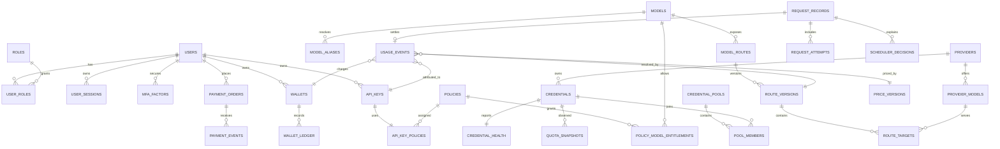

# Bablo 数据模型规划

> 已由 `migrations/000001_initial_schema.sql`、`000002_fact_table_guards.sql`、`000003_wallet_payment_integrity.sql` 与 `000004_auth_security.sql` 落地；后续迁移必须新增版本文件，不得重写已应用文件。
> 日期：2026-08-29
> 事实来源：PostgreSQL；Redis 只存可重建状态

## 1. 全局规则

- 所有主键使用项目统一的 UUIDv7（若实现阶段因驱动限制采用等价有序 UUID，必须在 ADR/迁移说明）；时间统一 UTC `timestamptz`；
- 金额用 `amount_minor bigint` + `currency char(3)`，或经核准的 PostgreSQL `numeric`；禁止 float；
- 账本、UsageEvent、PaymentEvent、AuditLog 追加式且不可破坏式删除；纠错新增 adjustment/reconciliation；Credential secret history 只允许追加新版本和设置 rotated_at，不允许删除/篡改密文；
- API Key 只存不可逆 hash、短 prefix、元数据；Credential secret 只存 AEAD ciphertext、12-byte nonce、key_version；
- 所有业务外键明确租户/所有者检查，禁止仅靠前端隔离；Credential pool 与 Credential 必须属于同一 Provider；
- route 和 price 在请求开始时形成不可变 snapshot，后续配置修改不重写历史。

## 2. 核心实体关系

## 3. 实体与关键字段

### Identity / policy

- `users`：`id`, `email_normalized`, `password_hash`, `password_params_version`, `password_changed_at`, `status`, `created_at`, `updated_at`；当前密码 hash 为 Argon2id PHC，参数策略单独版本化；
- `roles`、`user_roles`：至少 `admin`、`user`；角色变更写 audit；
- `user_sessions`：`id`, `user_id`, unique `token_hash`, `csrf_token_hash`, `expires_at`, `revoked_at`, `mfa_verified_at`, `last_seen_at`, device metadata；数据库不存明文 Session/CSRF token；
- `mfa_factors`：每个 `(user_id, factor_type)` 唯一；TOTP 保存 AEAD ciphertext/nonce/key_version、enabled/confirmed、`last_totp_counter`；恢复码只存 hash 和 `consumed_at`，条件 UPDATE 单次消费；
- `api_keys`：`id`, `user_id`, `name`, `key_prefix`, `secret_hash`, `secret_version`, `status`, `expires_at`, canonical CIDR IP policy, RPM/TPM/daily/monthly budget, `last_used_at`, `rotated_at`, `created_at`, `updated_at`；Key 使用 `bablo_sk_` + 32-byte CSPRNG base64url，数据库只保存完整 Key 的 SHA-256 与展示 prefix，没有 `group_id`/单一 `provider_id`；
- `policies`、`api_key_policies`、`policy_model_entitlements`：表达 Key -> policy -> 多模型 entitlement；用户 Key 使用 metadata 标识的 managed policy 和 default deny，显式 deny 优先于 allow，最后才考虑 policy default action；授权替换与 Key 更新在同一事务内完成。

### Catalog / route / credential

- `models`：canonical `public_model_id`、独立 `model_aliases`（禁用后仍保留标识不可重分配）、canonical capabilities、visibility、billing class、enabled；
- `providers`：slug、display name、`resource_type`（`official_api`/`enterprise_api`/`subscription`/`third_party`）、`commercial_allowed`、endpoint policy；P0 对 subscription 强制不商业开放；
- `provider_models`：`provider_id`, upstream model ID, protocol/capabilities, enabled, `review_status`、`discovery_status`、discovered/last-seen timestamps；发现新增项默认 pending/disabled，发现消失不自动禁用已批准配置；
- `credentials`：provider、external stable ID、source kind、status、proxy/region metadata、pool state；
- `credential_secrets`：credential 一对一或版本化记录，`ciphertext`, `nonce`, `key_version`, secret kind；与普通 credential metadata 分离；
- `credential_pools`、`pool_members`：可供 route target 使用的资源池，成员有 priority/weight/enabled；
- `credential_health`：last success/error class、cooldown_until、observed_at；
- `model_routes`：public model、match type/value（P0 exact）、enabled、active version；
- `route_versions`：route、monotonic version、effective window、created_by、snapshot hash；
- `route_targets`：route version、provider model、credential pool、priority、weight、commercial policy、enabled；请求使用单一 version snapshot。

### Quota / pricing

- `quota_snapshots`：credential、window kind、used/remaining/limit（可空）、reset_at、observed_at、source、confidence、error、stale 计算信息；采集失败不刷新 `observed_at`；
- `price_versions`：scope、version、effective_from/to、currency、status、created_by；只有 active/retired 且请求时刻位于 effective window 的已发布版本可创建非零 reservation；
- `model_prices`：price version、resolved provider model 或 billing scope、input/output/cache-read/cache-write/reasoning/per-request 单价；`unit_price` 是主货币单位/一个维度单位的 decimal，缺价不得静默按 0。

### Request / usage / scheduler

- `request_records`：`request_id`, user, API key, endpoint, requested model, stream flag, started/finished, terminal status；不存正文；
- `request_attempts`：request、attempt_no、route version、provider、credential、upstream status/error、latency/TTFT、started/finished；用于 fallback 与排障；
- `usage_events`：不可变结算事实，每个逻辑 `request_id` 至多一条，包含 request/user/key/wallet、requested/resolved model、provider/provider model/route version/credential、price version、started/finished、token breakdown、amount/currency、status/error、latency/TTFT、estimated/provenance、settlement key；非零金额要求 wallet，`request_record_id` 若存在必须与 `request_id` 对应，`usage_reconciliations` 只追加迟到差异，不覆盖原始事件。
- `scheduler_decisions`：request/attempt、候选内部 ID、排除原因、score/priority、selected、fallback chain、strategy version；JSON 只含非敏感 metadata；

- `scheduler_decisions` 的选中字段同时保存 route version、target、provider、credential；新决策必须满足三者成组一致，历史仅有 target 的记录保持可读。`credentials.max_concurrency` 为 1–10000；Redis 仅保存带 TTL 的 lease、cursor、affinity，不是事实源。
- `outbox_events`：与关键业务事务同库提交，worker 可重试、claim、幂等消费。

### Wallet / payment / audit

- `wallets`：user、currency、`available_balance_minor`、`reserved_balance_minor`、status、version；两种余额都是 transaction 内维护、可由 ledger delta 重建的投影，均不得为负；
- `wallet_reservations`：request/wallet/user/key、request record、resolved model/provider model/route/provider/credential、已发布 price version、预估 token、预留金额、状态和最终 UsageEvent；同一 request 的载荷不可漂移；
- `billing_settlements`：reservation、UsageEvent、reserved/actual amount、estimated、status/error 和幂等键；`pending` 表示最终金额暂时无法完整扣除，保留 reservation 等待重试/对账；
- `wallet_ledger`：wallet、entry type、signed amount、available/reserved delta、两种 balance-after snapshot、currency、reference、idempotency key、UsageEvent/operator/source、created_at；追加式，delta 是重建权威；
- `payment_orders`：全局 order no、user、amount/currency、provider、provider trade no、状态机 `created -> pending -> paid/failed/expired/refunded/closed`；
- `payment_events`：provider event/trade ID、原始 payload hash（非必要正文）、验签结果、received_at、处理状态；
- `audit_logs`：actor、action、target、before/after 摘要（脱敏）、request ID、result、created_at；
- `stats_rollups`：按小时/天和受控维度聚合，必须可由 Usage/Ledger 重建，不是事实源。

## 4. 唯一约束与幂等键

| 对象 | 必须唯一/幂等 |
|---|---|
| user | `lower(email_normalized)` |
| session | `token_hash`；有效 Session 同时必须有 `csrf_token_hash`，撤销不删除历史 |
| MFA | `(user_id, factor_type)`；recovery `(factor_id, code_hash)`，TOTP counter/恢复码消费在行锁事务内防重放 |
| API Key | `secret_hash`；prefix 仅展示索引，不代替 hash |
| entitlement | `(policy_id, model_id)` |
| provider/model | `(provider_id, upstream_model_id)`；发现和人工映射共用稳定上游 identity |
| credential | `(provider_id, external_stable_id)`（无稳定 ID 时用受控 fingerprint） |
| pool membership | `(pool_id, credential_id)` |
| route version | `(route_id, version_no)`；target 顺序/目标 identity 在同一 version 内唯一 |
| public model/alias | `lower(public_model_id)`、`lower(alias)` 各自唯一且跨表互斥；禁用 alias 仍保留占位 |
| price version | `(scope, version_no)`；同一 scope 的 published effective intervals 不重叠 |
| price | `(price_version_id, pricing_scope, target, dimension)`；同一版本目标维度唯一 |
| request | `request_id`；若已有 request 记录，重试必须 metadata 完全一致 |
| usage settle | `settlement_key` 与 `request_id` 均唯一；P0 由服务端派生 `usage:v1:<request_id>`，重复 finalize 返回已有结果 |
| wallet reservation | `request_id`、`(wallet_id, reservation_key)`、非空 `usage_event_id` 均唯一；同一 request 的 owner/route/price/estimate/amount 必须一致 |
| billing settlement | `reservation_id`、`usage_event_id`、`idempotency_key` 分别唯一；重复 settle 返回同一状态 |
| wallet ledger | `(wallet_id, idempotency_key)`；非空 `usage_event_id` 全局唯一，充值/退款/调账 reference 由调用方稳定派生 |
| payment order | `order_no`；外部 trade no 在 provider scope 内唯一 |
| payment event | `(payment_provider, provider_event_id)`；防重放 |
| scheduler decision | `(request_id, attempt_no, decision_no)` |
| audit | `event_id` 或 `(request_id, actor, action, target, nonce)` 按实现选定 |
| outbox | `(aggregate_type, aggregate_id, event_type, idempotency_key)`；processing claim 绑定 `claimed_by` owner token |

所有幂等键必须由服务端生成或从受信任的 provider event/request identity 派生，不能接受客户端任意覆盖账务事实。

## 5. 并发与账务不变量

1. reservation 使用 API-key advisory transaction lock 串行化 daily/monthly budget，再锁 wallet 行把 available 转入 reserved；不能先读余额再普通 UPDATE；
2. 任何 ledger entry 成功提交都必须有唯一 idempotency key；重试不新增第二笔，管理员调账同时写 audit；
3. reservation、usage charge、release 的 available/reserved delta 必须满足 entry-type 代数约束；`SUM(delta)` 必须重建钱包投影，数据库拒绝历史 ledger UPDATE/DELETE；
4. settle 少收释放、多收补扣；补扣余额不足时保留 reserved 并写 pending settlement/outbox，不能把差额静默记为免费或形成负余额；
5. `usage_events`、`payment_events`、`audit_logs` 不 UPDATE 既有事实来“修正”；新增 adjustment/reconciliation；
6. price version 切换只影响新请求；reservation 和 UsageEvent 必须绑定同一已发布版本、wallet、request 和 owner；
7. Redis 丢失不改变 PostgreSQL 账务；Redis lease/限流重建后不能绕过 DB 权限和预算事实。

## 6. 索引、保留与迁移

首批索引围绕真实查询：`user_id + created_at`、`api_key_id + created_at`、`public/resolved_model + created_at`、`provider_id/credential_id + created_at`、`request_id`、`order_no`、`status + created_at`、`observed_at`。高增长表按时间范围评估分区，但没有基准数据前不预先复杂分区。

Raw Usage、scheduler/audit、payment payload hash 和 rollup 的 retention 必须配置化并区分合规需要；账本与财务证据不得因 dashboard retention 被删除。所有结构变更走 SQL-first migration，要求空库 up、连续升级、重复启动安全和约束测试。当前首批 schema 已落地，高增长表仍保持未分区，待真实基准数据证明需要后再迁移。

## 7. 当前实现映射

- `migrations/000001_initial_schema.sql` 创建身份、授权、模型、Provider、Credential、Route、Quota、Price、Request、Usage、Wallet、Payment、Audit、Outbox 和 Stats 核心表。
- `migrations/000002_fact_table_guards.sql` 为 Usage、reconciliation、Wallet Ledger、Payment Event、Scheduler Decision 和 Audit 建立数据库级 append-only 防护，并校验 pool/credential 与 route target/provider 的归属一致性。
- `migrations/000003_wallet_payment_integrity.sql`、`000004_auth_security.sql`、`000005_api_key_security.sql` 分别补充账务/支付、Web Session/MFA 和 API Key 安全约束；已应用迁移保持不可变。
- `migrations/000006_model_catalog_integrity.sql` 新增 `model_aliases`、大小写不敏感且跨表互斥的 model identifier guards、provider model discovery/review 状态、published price entry/version guards 与生效区间互斥。
- `migrations/000007_credential_security.sql` 增加 Credential runtime metadata、source-kind/secret ciphertext/key/rotation 约束、source identity guard、secret history append-only、pool identity guard 和 active-secret 索引。
- `migrations/000008_route_integrity.sql` 增加 Route match/hash/metadata 约束；Route version 仅允许一次性关闭，Route target immutable，所有新 target 集合必须通过新 version 发布。
- `migrations/000009_scheduler_integrity.sql` 增加 Credential 并发容量约束、Scheduler 决策选中路由/provider/credential 关联字段、历史兼容约束和数据库选择一致性 trigger；Scheduler 运行态仍由 Redis TTL 状态协调。
- `migrations/000010_usage_integrity.sql` 增加 Usage `request_id` 唯一索引、started/finished 时间快照、request-record 关联与 settlement/request/source/claim-owner 输入约束；从 v9 回填历史 Usage 时间并恢复 append-only trigger，outbox claim/retry/publish 由 `internal/usage` 以 owner token 和 stale lease 实现。
- `migrations/000011_billing_integrity.sql` 增加 reservation/settlement、explicit available/reserved ledger delta、balance-after snapshot、published-price/owner/Usage cross-table guard、ledger immutability、API-key budget 与 settlement 查询索引；migration 已验证空 schema up、latest down 和重放。
- `internal/model` 实现 canonical ID/alias 解析、public/admin 列表、能力/visibility/billing class 校验和 route readiness；alias 禁用后不被重新分配。
- `internal/provider` 实现资源政策、上游模型映射和完整 discovery snapshot reconcile；新增发现 pending/disabled，缺失只改变 discovery signal，批准配置不被发现覆盖。
- `internal/credential` 实现 non-secret DTO、AES-GCM secret create/rotate/reencrypt、active runtime source、monotonic health、Provider pool membership 和 opaque composite cursor；管理员 API 永不返回 secret value。
- `internal/pricing` 使用 decimal string + `numeric(30,12)`，实现 draft/activate/retire 与 provider_model -> model -> global 价格解析；缺价/禁用计费 fail closed。
- `internal/route` 实现 P0 exact route、多 Provider/Pool candidate、snapshot hash、active version 原子切换、opaque cursor、preview/resolution 和管理员 API；resolver 只产出 scheduler candidates，不选择 Credential。
- `internal/scheduler` 实现 target/member 硬过滤、429 cooldown、quota freshness/reset、priority/fill-first/round-robin/weighted-round-robin/quota-aware、有限 affinity、Redis/内存 TTL lease/cursor/affinity 和 immutable Decision Log；它只接收 Route resolution，不暴露 CPA 类型。
- `internal/usage` 实现 request record 幂等、immutable UsageEvent、stream/cancel/no-usage 状态、late reconciliation、transactional outbox claim/ack/retry；Proxy 只提交领域输入，不暴露 CPA 类型或正文。
- `internal/billing` 使用 decimal string + `math/big` 汇总后一次换算最小货币单位，实现 Quote/Reserve/Settle/Release/Credit/GetWallet/RebuildBalance；Proxy 在 CPA 执行前 reserve、UsageEvent 后 settle，missing usage 按 reservation 估算结算而不静默免费。
- `cmd/bablo/catalog.go` 将用户模型目录和 admin model/provider/price/route handlers 接入 Web Session/RBAC；`Store.WithTx` 保持 repository 事务边界，应用启动不自动迁移。
